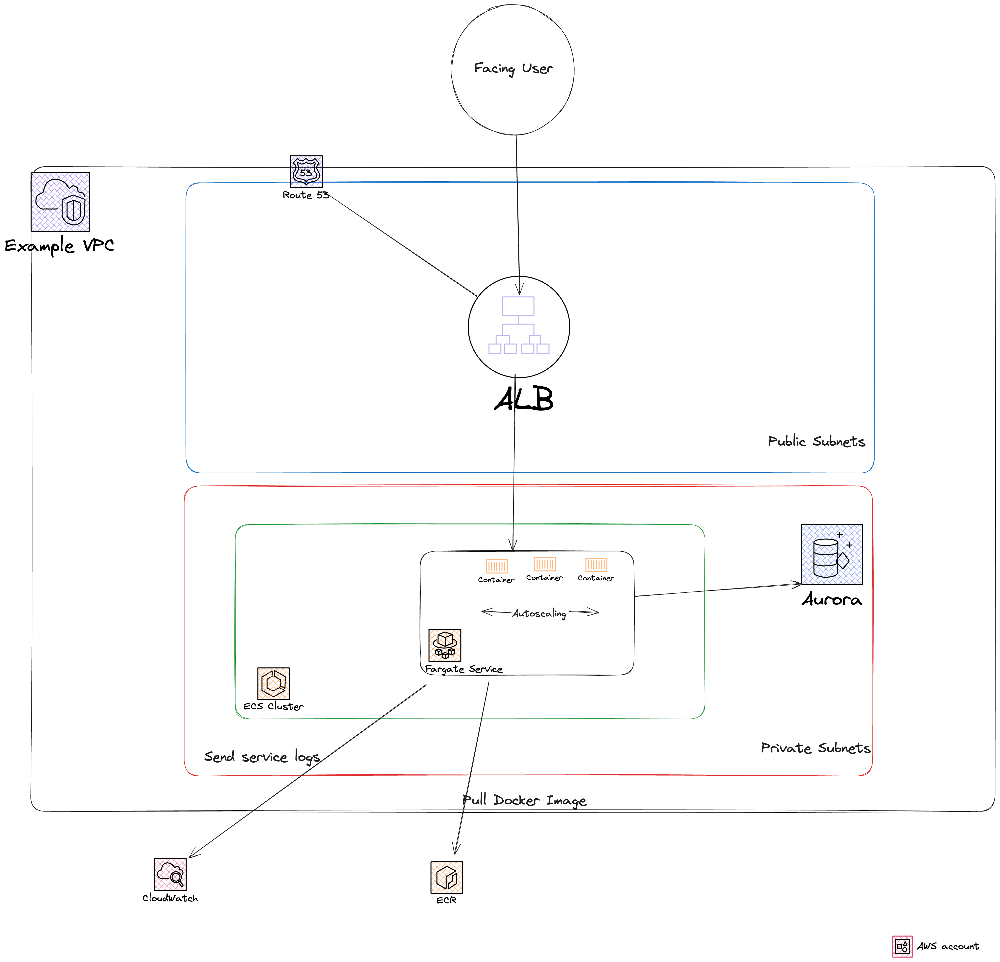
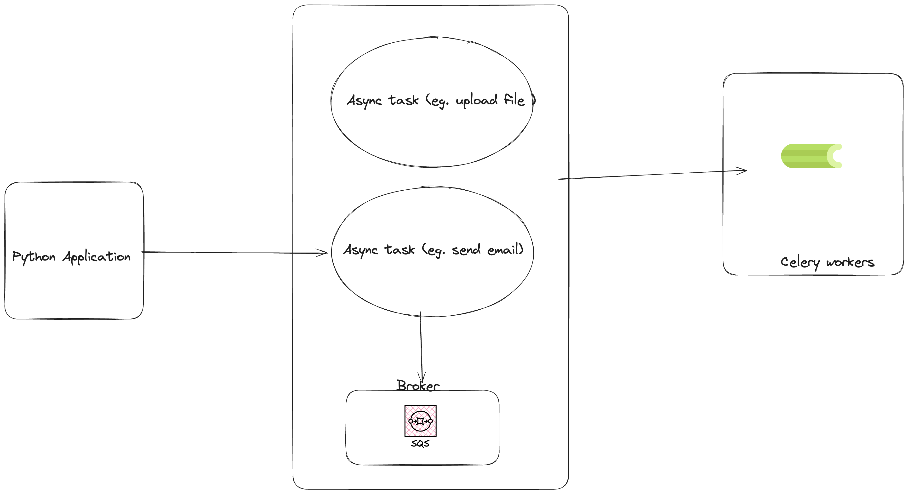
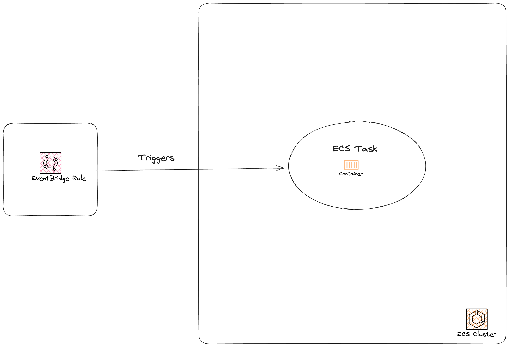

# Uptime Infrastructure

## Architecture Diagram
The whole infrastructure diagram is presented below. A user will access the service using a browser.
The request will be handled by an Application Load balancer that will forward it to our ECS Fargate service
using the correct target group. Our service communicates with an Aurora RDS using private subnets.




## Components
### ECS
ECS components are consisted of: ECS Cluster which is can contain multiple ECS Services or ECS Tasks,
the ECS Service which runs our containirized service and ECS Task definition which defines the configuration
that the ECS service is using for our container. The service will be deployed in our private subnets ensuring high availability.
Also an autoscaling mechanism will be triggered to increase the number of replicas based on a metric that will define.
Currently, we are using a CPU target on 80% capacity.
We also use a spot capacity provider to use in case our service is stateless.

### ECR
A container repository where we can upload our container image.
Example way to deploy using a script and the AWS CLI:

### VPC
We also add a VPC as a supporting resouces that creates a new VPC, subnets, IGW, NAT Gateway, route tables, routes and more. Again we used an open source module to define all of the resources as it a production ready to use module without the maintenance cost.

```
#!/bin/bash
set -eux -o pipefail

# Variables
AWS_REGION="eu-west-1
AWS_ACCOUNT_ID="123456789"
IMAGE_TAG="1.0.0"
ECR_REPOSITORY_NAME="uptime-app"

# Authenticate to ECR
aws ecr get-login-password --region $AWS_REGION | docker login --username AWS --password-stdin $AWS_ACCOUNT_ID.dkr.ecr.$AWS_REGION.amazonaws.com

# Tag the Docker image with the ECR repository URI
ECR_URI="$AWS_ACCOUNT_ID.dkr.ecr.$AWS_REGION.amazonaws.com/$ECR_REPOSITORY_NAME"
docker tag $IMAGE_NAME:$IMAGE_TAG $ECR_URI:$IMAGE_TAG

# Build and push the image to the ECR repository
docker build -t $ECR_URI:$IMAGE_TAG /path/to/dockerfile
docker push $ECR_URI:$IMAGE_TAG
```

### Application Load balancer
An application Load balancer will act as the front end of our service, deployed in a public subnet so the application
can be accessible from anywhere.

### Aurora RDS
For our Postgres database we will use AWS Managed database offering Aurora RDS. I decided to use Aurora instead of plain RDS
to ensure high availability and better performance using read replicas as well as out-of-the-box autoscaling mechanisms.

## Terraform
Terraform code is organized into two separate directories.
`modules` directory contains the reusable modules to be used by different services.
`stacks` directory contains stacks for various environments, services, accounts etc.

Modules directory only contain the modules that can be then used by stacks to run the actual code and provision the resources.

How to run:
1. Navigate into stacks/production directory
2. Run `terraform init` to initialize the backend and the aws provider. `backend.tf` file is commented out, but in a real
production environment you should use a secure and highly available remote backend like s3 as well as a locking mechanism such as `dynamodb`.
3. Run `terraform plan` to preview the AWS resources that will be created.
4. Finally run `terraform apply` to apply the resources.

Notes: For RDS we use an open-source module to have a production ready and secure Postgres cluster.
All relevant resources have a `cost-report-tags` attribute to identify and manage the costs of our service.

## TODO/Improvements
- Create a custom domain using route53.
- Use AWS Certificate manager and use HTTPS instead of HTTP for the service.
- Use a secret manager service such as AWS Secrets Manager to handle database password or other keys.
- Use AWS WAF to protect the service from DDOS or other malicious attacks.


## Background tasks / Scheduled tasks
1. In order to handle background tasks I would proceed with using [Celery](https://github.com/celery/celery) since we are deploying a Python application.

Celery is a task queue implementation for Python web applications used to asynchronously execute work suitable for background jobs.

As a task queue (the backend which Celery will use) we can use AWS SQS as we are in a fully AWS environment.

The flow would be similar to this:




2. For scheduled Tasks we can leverage the ECS platform and the ECS Scheduled tasks feature. In order to do that we need to create an AWS Eventbridge rule to handle the scheduling of our jobs.
When the rule is being triggered, a new ECS Container will be started containing the script/code we need to run. After it finishes it will exit and the ECS will be terminated.

Example architecture:


